# 👋 Hi, I’m Leonardo Jiménez

    
    

## About me

I’m a backend-focused developer currently deepening my knowledge in:
- **Backend and systems design**
- **Low-level and systems concepts**
- **Infrastructure and developer tooling**

I’m especially interested in understanding *why* things work the way they do, not just *how* to use them.  
My goal is building software that becomes simpler and easier to reason about over time.

## Tech I work with

### Main focus
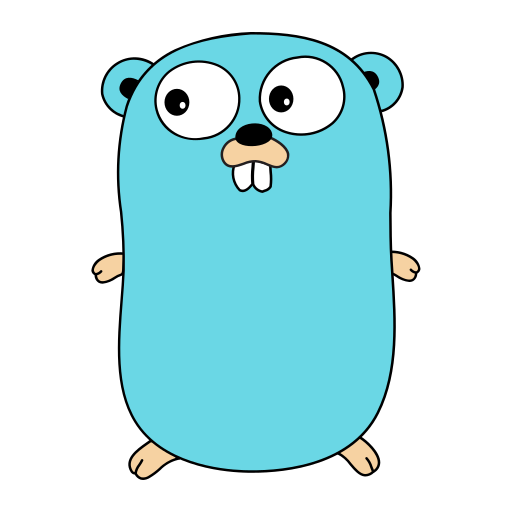

### Programming & systems

    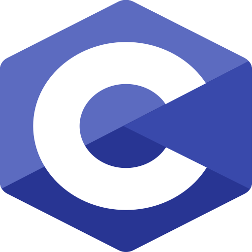
    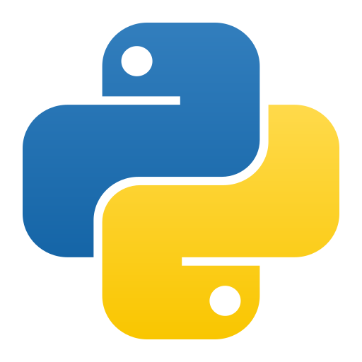
    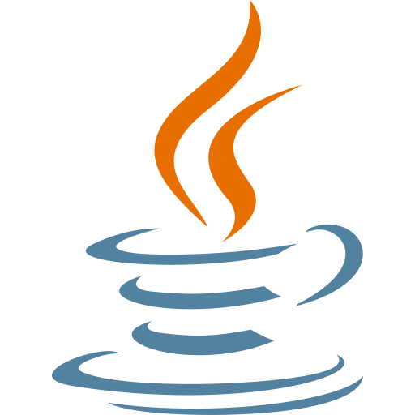
    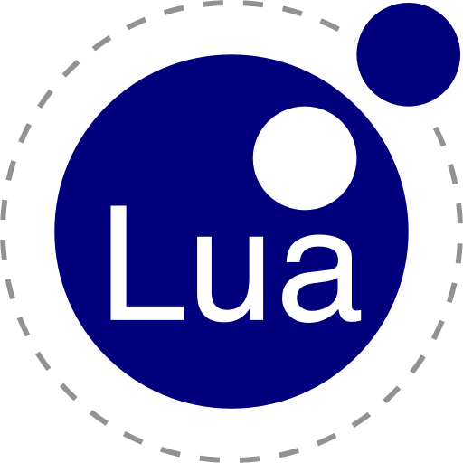

### Databases

    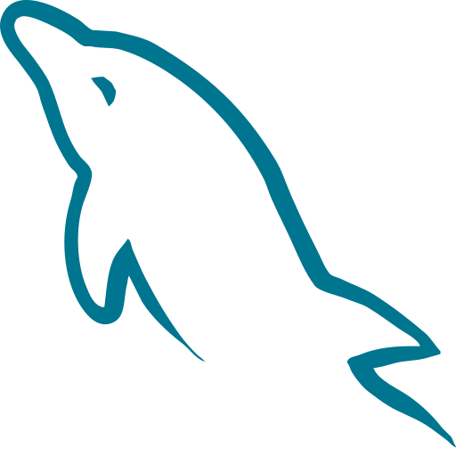
    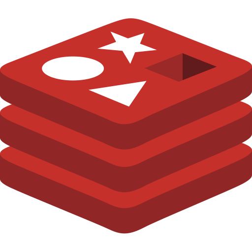
    
    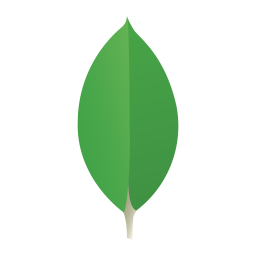

### Infrastructure & tools

    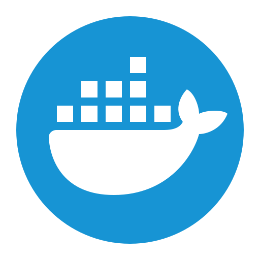
    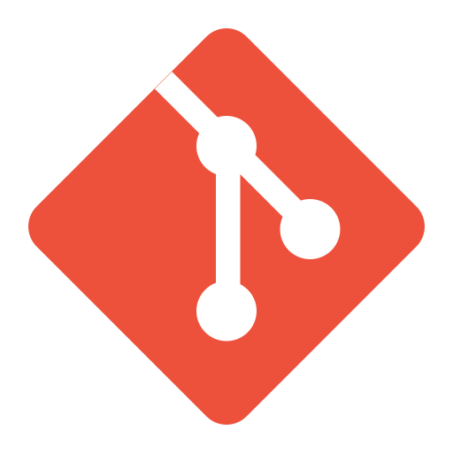
    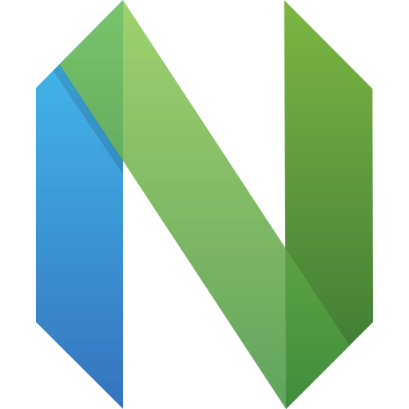
    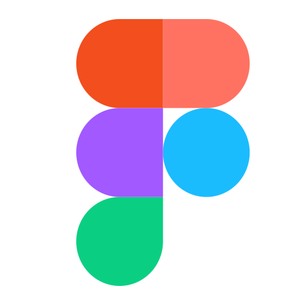

## Content & links

I share my learning process and experiments around development, Go, and systems-related topics:

- 🌐 **Website:** https://rtapi.dev/
- ✍️ **DEV:** https://dev.to/leojimenezg
- 📓 **Medium:** https://medium.com/@leojimenezg
- 🎥 **YouTube:** https://www.youtube.com/@leojimenezg
